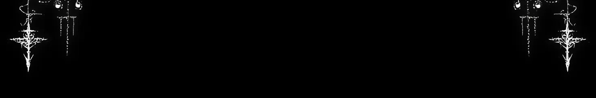

<div align="center">


<br/>

<h1>† &nbsp; Gabriel de Sousa Rocha &nbsp; †</h1>

<p><em>Backend Developer · Python &amp; APIs · Seeking Internship</em></p>

---

<h3>† Sobre mim †</h3>

```
📍 Sabará, MG — Brasil
🎓 Sistemas de Informação · IFMG · 3º período
🔭 Foco em backend assíncrono, APIs REST e LLMs
🌱 Aprendendo: FastAPI, arquitetura de microsserviços
⚙  Projetos publicados em github.com/gabriel448
```

---

<h3>† Stack †</h3>


---

<h3>† Projetos em destaque †</h3>

| Projeto | Stack | Status |
|:---:|:---:|:---:|
| 🎮 Valorant Discord Bot | Python · discord.py · PostgreSQL · LLMs | Em produção |
| 🖥 PYCRUD | Python · PySide6 · JSON | Concluído |
| 🎵 MP3 Downloader | Python · yt-dlp · FFmpeg · QThread | Concluído |
| ♟ The CareTaker | Java · OOP | Concluído |

---

<h3>† GitHub Stats †</h3>

[](https://git.io/streak-stats)

---


---


<br/>
<sub>gabrieldesousa008@gmail.com · Sabará, MG</sub>

</div>